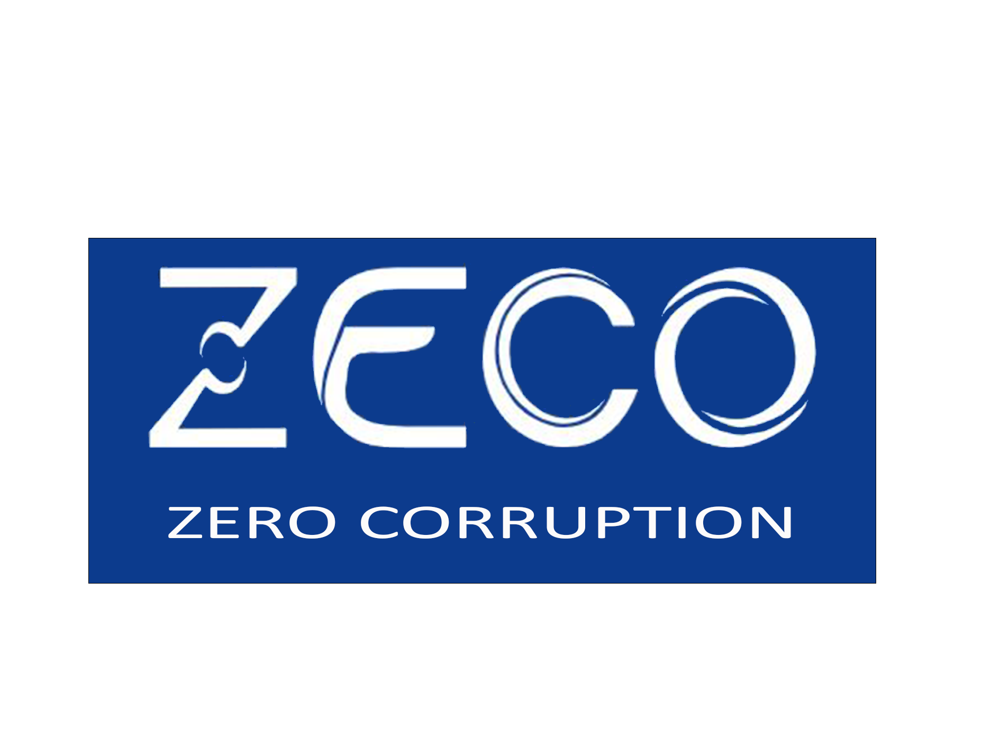

# zeco
The ZECO web solution, innovative thanks to the insertion of blockchain and AI, encourages the population to anonymously report acts of corruption. This secure and reliable solution is based on JavaScript and allows to denounce, to follow a complaint and to make investigations in companies.
<!--
*** This project is the result of a hackathon organized by the UNODC
*** Author : Salomon D., Edison K., Mame Faty K.
-->


<!-- PROJECT SHIELDS -->

[![Contributors][contributors-shield]][contributors-url]
[![Forks][forks-shield]][forks-url]
[![Stargazers][stars-shield]][stars-url]
[![Issues][issues-shield]][issues-url]
[![MIT License][license-shield]][license-url]
[![LinkedIn][linkedin-shield]][linkedin-url]


<!-- PROJECT LOGO -->
<br />
<p align="center">
  <a href="https://github.com/salomon-dhn/zeco">
    
  </a>

  <h3 align="center">ZECO</h3>

  <p align="center">
    The ZECO web solution, innovative thanks to the insertion of blockchain and AI, encourages the population to anonymously report acts of corruption. This secure and reliable solution is based on JavaScript and allows to denounce, to follow a complaint and to make investigations in companies.
    <br />
    <a href="https://github.com/salomon-dhn/zeco"><strong>Explore the docs »</strong></a>
    <br />
    <br />
    <a href="https://github.com/salomon-dhn/zeco">View Demo</a>
    ·
    <a href="https://github.com/salomon-dhn/zeco/issues">Report Bug</a>
    ·
    <a href="https://github.com/salomon-dhn/zeco/pulls">Request Feature</a>
  </p>
</p>


<!-- TABLE OF CONTENTS -->
<details open="open">
  <summary><h2 style="display: inline-block">Table of Contents</h2></summary>
  <ol>
    <li>
      <a href="#about-the-project">About The Project</a>
      <ul>
        <li><a href="#built-with">Built With</a></li>
      </ul>
    </li>
    <li>
      <a href="#getting-started">Getting Started</a>
      <ul>
        <li><a href="#prerequisites">Prerequisites</a></li>
        <li><a href="#installation">Installation</a></li>
      </ul>
    </li>
    <li><a href="#usage">Usage</a></li>
    <li><a href="#roadmap">Roadmap</a></li>
    <li><a href="#contributing">Contributing</a></li>
    <li><a href="#license">License</a></li>
    <li><a href="#contact">Contact</a></li>
    <li><a href="#acknowledgements">Acknowledgements</a></li>
  </ol>
</details>


<!-- ABOUT THE PROJECT -->
## About The Project
The ZECO web solution, innovative thanks to the insertion of blockchain and AI, encourages the population to anonymously report acts of corruption. This secure and reliable solution is based on JavaScript and allows to denounce, to follow a complaint and to make investigations in companies.
    <br />
<br />
<p align="center">
<a align="center" href="https://github.com/salomon-dhn/zeco">
  
</a>
</p>

### Built With

* [Node JS](https://nodejs.org)
* [EJS](https://ejs.co/)
* [ExpressJS](https://expressjs.com/fr/)
* [Solidity](https://docs.soliditylang.org/en/v0.8.9/#)


<!-- GETTING STARTED -->
## Getting Started

To get a local copy up and running follow these simple steps.

### Prerequisites

* NodeJS
The installation of the NodeJS engine greater than or equal to 14.17 is required. You can download it on the official NodeJS download site : [NodeJS Download page](https://nodejs.org/en/download/)

* Ganache
It can be downloaded from the trufflesuite website: [Ganache download page](https://www.trufflesuite.com/ganache)

### Installation

1. Clone the repo
    ```sh
    git clone https://github.com/salomon-dhn/zeco.git
    ```
2. Install NPM packages
    ```sh
    npm install
    ```
3. Deployment on local contract
    ```sh
    cd publics/blockchain/
    truffle migrate --network development
    truffle migrate --network development --reset
    ```
4. Launch Ganache application

5. Run application
    ```sh
    cd ../..
    node index.js
    ```


<!-- USAGE EXAMPLES -->
## Usage

_For more examples, please refer to the [Documentation](https://reactnative.dev/docs/getting-started)_


<p align="right">(<a href="#top">back to top</a>)</p>

<!-- ROADMAP -->
## Roadmap

See the [open issues](https://github.com/salomon-dhn/zeco/issues) for a list of proposed features (and known issues).


<!-- CONTRIBUTING -->
## Contributing

Contributions are what make the open source community such an amazing place to be learn, inspire, and create. Any contributions you make are **greatly appreciated**.

1. Fork the Project
2. Create your Feature Branch (`git checkout -b feature/AmazingFeature`)
3. Commit your Changes (`git commit -m 'Add some AmazingFeature'`)
4. Push to the Branch (`git push origin feature/AmazingFeature`)
5. Open a Pull Request


<!-- LICENSE -->
## License

Distributed under the MIT License. See `LICENSE` for more information.


<!-- CONTACT -->
## Contact

LinkedIN : 
* [Salomon](https://www.linkedin.com/in/1sal)
* [Edison](https://sn.linkedin.com/in/edison-kassin) 
* [Mame Faty](https://sn.linkedin.com/in/mame-faty-kane-621a48167)

Project Link: [https://github.com/salomon-dhn/zeco](https://github.com/salomon-dhn/zeco)


<!-- ACKNOWLEDGEMENTS -->
## Acknowledgements
- Mentors :
    * Christelle Scharff
    * Saliou DIOP

- Other :
    * [EJS](https://ejs.co/)
    * [ExpressJS](https://expressjs.com/fr/)
    * [Solidity](https://docs.soliditylang.org/en/v0.8.9/#)
    * [Truffle Suite](https://ionic.io/ionicons)


<!-- MARKDOWN LINKS & IMAGES -->
<!-- https://www.markdownguide.org/basic-syntax/#reference-style-links -->
[contributors-shield]: https://img.shields.io/github/contributors/salomon-dhn/app-movies-react-native.svg?style=for-the-badge
[contributors-url]: https://github.com/salomon-dhn/zeco/graphs/contributors
[forks-shield]: https://img.shields.io/github/forks/salomon-dhn/app-movies-react-native.svg?style=for-the-badge
[forks-url]: https://github.com/salomon-dhn/zeco/network/members
[stars-shield]: https://img.shields.io/github/stars/salomon-dhn/app-movies-react-native.svg?style=for-the-badge
[stars-url]: https://github.com/salomon-dhn/zeco/stargazers
[issues-shield]: https://img.shields.io/github/issues/salomon-dhn/app-movies-react-native.svg?style=for-the-badge
[issues-url]: https://github.com/salomon-dhn/zeco/issues
[license-shield]: https://img.shields.io/github/license/salomon-dhn/app-movies-react-native.svg?style=for-the-badge
[license-url]: https://github.com/salomon-dhn/zeco/tree/master/LICENSE
[linkedin-shield]: https://img.shields.io/badge/-LinkedIn-black.svg?style=for-the-badge&logo=linkedin&colorB=555
[linkedin-url]: https://github.com/salomon-dhn
[product-screenshot]: https://github.com/salomon-dhn/web-page/blob/main/assets/img/app.gif
